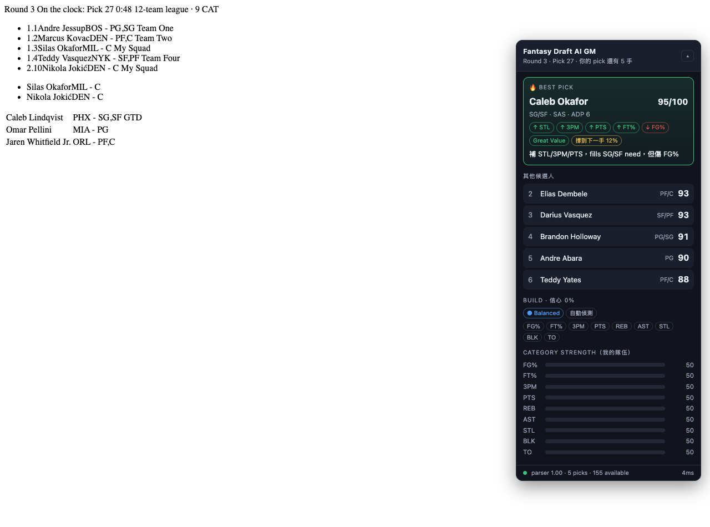

# Fantasy Draft AI Copilot

Chrome MV3 擴充功能：在 Yahoo Fantasy Basketball Draft Room 旁邊顯示一個即時 9-CAT
推薦面板。**只讀頁面、不自動選秀**，所有選擇仍由使用者按下 Draft。

推薦引擎完全在本機執行（deterministic），LLM 只負責產生一句話解釋；AI 掛掉、逾時或
沒設定時，推薦照常運作。



---

## 快速開始

### 給沒裝過開發環境的朋友（最簡單）

不需要 `npm install`，直接用打包好的 zip：

1. 到 `release/` 資料夾拿 `fantasy-draft-copilot.zip` 和 `安裝說明.md`
2. 照 `安裝說明.md` 的步驟裝（解壓縮 → `chrome://extensions` → 開發人員模式 → 載入未封裝項目）

要更新分享用的 zip：

```bash
npm run build
cd dist && zip -rq ../release/fantasy-draft-copilot.zip . -x ".*" && cd ..
```

### 給會跑指令的人

```bash
npm install
npm run build
```

Chrome → `chrome://extensions` → 開啟右上角 **Developer mode** → **Load unpacked** →
選擇專案下的 `dist/` 資料夾。

載入後：

1. 點擊擴充功能圖示（或 `chrome://extensions` 的 **Details → Extension options**）開啟設定頁。
2. 匯入球員 projections（CSV / JSON），或先按「載入示範球員池」用虛構資料試跑。
3. 設定聯盟：隊伍數、roster slots、我的 draft slot。
4. 進入 Yahoo Draft Room，右側會出現面板。

開發模式（watch 重建）：

```bash
npm run dev      # 改完程式後在 chrome://extensions 按一次 reload
npm test         # vitest：74 個單元 / 整合測試
npm run typecheck
npm run e2e      # Playwright：實際載入 dist/ 並跑 fixture draft room
```

---

## 不用 Yahoo 也能試：mock 與 fixture 模式

真實 Draft Room 難以重現，所以整條管線都能離線跑：

```bash
node scripts/fixture-server.mjs
```

| 網址 | 模式 | 用途 |
| --- | --- | --- |
| `http://localhost:5178/yahoo/draft-room-v1.html?draftcopilot=fixture` | fixture | 用 DOM parser 解析固定 HTML |
| `http://localhost:5178/yahoo/draft-room-v2.html?draftcopilot=fixture` | fixture | 改版後的 fallback selector |
| `http://localhost:5178/yahoo/parser-broken.html?draftcopilot=fixture` | fixture | 驗證「parser 壞掉要大聲報錯」 |
| 任何 `http://localhost/...?draftcopilot=mock` | mock | 完整 snake draft 模擬器，面板下方有「模擬下一手 / 替我選」 |

mock / fixture 模式在沒有匯入資料時會使用 `src/domain/player/demoPool.ts` 的
**虛構球員與虛構 projections**（僅供測試，不是真實預測）。

---

## 架構

```text
Yahoo Draft Room DOM
  └── content script
        ├── YahooDraftAdapter  ← 唯一會碰 DOM 的地方（selectors.ts / parser.ts / observer.ts）
        ├── MockDraftAdapter   ← 同一個介面的模擬器
        ↓ AdapterSnapshot（含 ParserHealth confidence）
      buildDraftState()        ← 正規化 + Zod 驗證 + 去重 + snake 計算
        ↓ DraftState
      RecommendationEngine     ← z-score / punt / scarcity / survival / scoring
        ↓ EngineResult
      Zustand store → Overlay（Shadow DOM）
        └── 非同步、可失敗的 LLM 解釋
```

| 目錄 | 內容 |
| --- | --- |
| `src/content/adapter.ts` | `DraftPlatformAdapter` 介面與 parser health 計分 |
| `src/content/yahoo/` | selectors / parser / observer / DOM inspector |
| `src/content/mock/` | snake draft 模擬器 |
| `src/domain/player/` | CSV·JSON 匯入、名字正規化比對、示範球員池 |
| `src/domain/recommendation/` | zscore、punt、scarcity、rosterFit、scoring、engine |
| `src/store/` | `buildDraftState`、Zustand store、chrome.storage 持久化 |
| `src/ui/overlay/` | Overlay React 元件（Shadow DOM + inline CSS） |
| `src/options/` | 設定頁 |
| `src/llm/` | prompt 組裝、OpenAI adapter、timeout / 護欄 |

**排名引擎絕對不會直接 query DOM**；所有 selector 都集中在
`src/content/yahoo/selectors.ts`。

### 推薦分數

```text
FinalScore = BaseValue*0.35 + RosterFit*0.22 + CategoryNeed*0.15 + PuntFit*0.10
           + Scarcity*0.08 + ADPValue*0.05 + Upside*0.03 - InjuryRisk*0.02
```

權重可在設定頁調整。要點：

- **百分比項目用 volume-adjusted impact**：`(playerFG% - leagueAvgFG%) * FGA`，
  不是對 FG% 直接做 z-score。沒有 FGA/FTA 欄位時會用得分量估算。
- **TO 反向**：z-score 取負號，越少越好。
- **出場數是第一級變數**：把整季總和除以 GP 之後，45 場的球星和 78 場的球星每場數據
  一模一樣 —— GP 在那一步被約分掉了。現在 z-score 會乘上
  `(預計出場 / 健康基準)^出場數權重`，而且**負面 category 也一起縮小**（少打球的人
  對你的失誤也傷害較小）。權重可調：`0` = 只看每場、`1` = 線性折算（Roto），預設 `0.5`
  （45 場保留約 76% 價值）。健康基準取球員池 GP 的第 90 百分位，會自動適應投影來源。
- **缺賽不重複計費**：出場數進了 value 之後，`injuryRisk` 只保留「目前的傷兵標記」與
  「預計不到 55 場」的尾端風險，否則每個不是鐵人的球員都會被罰兩次。
- **Punt**：hard = 權重 0，soft = 0.35；punt 掉的 category 不會再算進「需要補」。
- **Auto punt 有輪次閘門**：R1 不鎖、R2 只觀察、R3+ 才允許 soft、R5+ 且證據夠強才 hard，
  最多兩個 category，TO 永不 hard punt。
- **Scarcity** 是「現在的品質 − 下一手預期的品質」，不是單純數人頭。
- **Survival probability**：以市場（ADP）排序估計球員能不能撐到你的下一手；<20% 代表現在不拿就沒了。
- **ADP 不能主導**：權重只有 0.05。
- **釘選只改順序，不改分數**：分數代表球員價值，不該因為使用者的偏好而變動，
  否則那個數字就沒有參考意義了。釘選的人會排到第一並標上 📌，分數維持原值。
- **Base value 用 logistic 而非線性截斷**：線性映射在頂端會飽和，所有頂尖球員都變成
  剛好 1.0，35% 權重的那個成分就分不出超級巨星和很好的球員了。
- **分數是絕對值，不是排名**：`score = 加權總分 / 理論滿分 × 100`，代表「這一手拿到了
  理想選擇的幾成」。早期的版本把第一名固定錨在 95，看起來像絕對分其實只編碼了名次 —— 
  第 1 輪的 95 和第 12 輪的 95 完全不可比。現在板凳變薄時整排分數會一起下降，那才是實話。
- **標準化基準只建立一次**：用開盤時看到的完整球員池，之後固定不動。若隨著球員被選走
  重算，基準會一直往下漂，剩下的人永遠看起來很精英。

> 註：規格書 §10 的公式寫成 `valueDiff = playerADP - currentOverallPick`，但同段的例子
> （ADP 45、pick 60 → +15）是相反方向。程式採用例子的語意：**球員掉過 ADP 才算 value**。

---

## 人的判斷如何進入引擎

投影（Yahoo + Rotowire 的下季預測）已經涵蓋了大部分「下一季狀態預判」，但它抓不到
角色變化、傷病復原進度、年齡曲線、深度圖變動。這些缺口用兩個確定性管道補：

| 管道 | 來源 | 影響 |
| --- | --- | --- |
| 市場動能 | 頁面上的 `Rank` vs `L7ADP` 背離 | 餵進 upside（3%），並在卡片上顯示 📈/📉 |
| 球員註記 | 你自己標記，跨場次保留 | 有界推力 ±0.08，顯示 ★/☆ 與理由 |

**刻意不做**：讓 LLM 提供球員知識。它的認知停在訓練截止日，而且錯的時候語氣跟對的時候
一樣自信 —— 在 30 秒要決定的選秀現場，一句幻覺比沒有更糟。這也是規格書 §13.4 的要求。

## 隱私

- 不讀、不傳 Yahoo cookie / session token / auth header。
- 不把頁面 HTML 或帳號資訊送給 LLM，只送正規化的籃球資料
  （聯盟規模、輪次、候選人名單、category 影響）— 見 `src/llm/prompt.ts`。
- API key 沒有硬編碼，只存在 `chrome.storage.local`（正式版建議改用 backend proxy）。
- DOM inspector 匯出前會清掉 email、長 ID、query string 與可疑屬性。
- session 只用 `hostname + pathname` 當 key，不含 league id 以外的查詢參數。

---

## Yahoo 真實 Draft Room 支援

已於 2026-09 對照真實 12 隊 H2H draft client（`basketball.fantasysports.yahoo.com/draftclient/...`）
校正完成，見 `src/content/yahoo/draftClient.ts`。該頁面沒有任何 `data-test`，但有可靠的結構：

| 需要的資料 | 真實來源 |
| --- | --- |
| 可選球員 + **投影數據** | Players `<table>`（表頭 `XRank / Rank / L7ADP / GP / FG% / FT% / 3PTM / PTS...`），每列含 `div.ys-player[data-id]` |
| 球員 ID | `data-id`（Yahoo 官方 ID，不靠名字比對） |
| 目前輪次 / pick | 狀態列 `Round 5, Pick 54` |
| 還有幾手輪到我 | 狀態列 `You're up in 1 Picks`（直接讀，不用推算） |
| 我的 draft slot | 由 `currentPick + picksUntilMe` 反推，比猜測可靠 |
| 計時器 | 狀態列 `00:29` |
| 我的陣容 | 右側 `YOUR TEAM (8/13)` 欄位裡的 `.ys-player`（**不是**選秀動態牆 — 那裡是別人的球員） |

重點設計：

- **不需要匯入 projections**。表格的計數項目是**季賽總和**，程式會用 GP 換算成每場
  （`1623 PTS ÷ 67 GP = 24.2`）。表格沒有 FGA/FTA 欄位，所以百分比項目的出手量用得分推估。
- **可選池直接用這張表**（Yahoo 已濾掉被選走的球員），因此 `availableIsAuthoritative = true`；
  其他頁面仍走「master DB − 已選球員」。
- **隊伍數不從頁面文字猜**。猜錯會讓 snake 計算整個錯掉且無聲無息，所以一律以設定頁為準。
- **總和/每場的判斷是整張表一次決定，不能逐欄判斷**。一個中鋒整季 8 顆三分若用
  「小於某門檻就是每場」的規則，會被讀成每場 8 顆三分，z-score 直接爆表。判斷依據是
  PTS 欄的中位數（沒人能場均 60 分，也沒有輪換球員整季只拿 60 分）。
- **投影快取**：球員一被選走就從表格消失，所以你自己的陣容會沒有數據、punt 偵測形同瞎子。
  程式會在每位球員還在板上時把投影記下來（以 `data-id` 為 key），存進 session，重整分頁也還在。
- **陣容錨點是 `YOUR TEAM (n/13)` 那段文字**。頁面上的選秀動態牆用的是一模一樣的 `.ys-player`
  元件（`81 David P. George...`），抓錯會把別人的球員算成你的；讀到的人數少於 `n` 時會出現警告，
  不會假裝陣容是完整的。
- 頁面的 atomic CSS（`D(f)`、`W(150px)`）與 hash class（`_ys_9w258l`）一律不依賴。

### 使用時的注意事項

1. **Players 分頁要開著** — 那是球員池與投影的唯一來源。
2. **位置篩選保持 `All Positions`** — 篩成單一位置時，推薦只會從那個位置裡挑。
3. **`Drafted` 切換保持關閉** — 打開會把已選球員混進表格。
4. **stat 下拉選季度投影**（例：`2026-27 Proj Stats`）。選 `Last 7 Days` 之類引擎照樣運作，
   但評估的是近期表現而不是整季預測。
5. **`YOUR TEAM` 欄位要看得到** — 你的陣容只在它渲染時存在於 DOM。沒看到時面板會提示，
   roster fit 與 punt 偵測不會啟用（其餘推薦照常）。陣容很長時記得捲到底。
6. **選秀開始前先開一次 Players 分頁** — 那時所有球員都還在板上，投影快取會一次填滿，
   之後整場（包含你已經選走的球員）都算得出 category 強弱與 punt。中途才安裝的話，
   在那之前就被選走的球員會缺數據。

### Yahoo 再次改版時怎麼修

1. 設定頁勾「啟用 DOM Inspector」→ 面板右上 🔍 匯出去識別化報告。
2. 看 `candidateRowSelectors` 找出新的重複列結構，對照 `draftClient.ts` 的假設修正。
3. 存一份 sanitized HTML 到 `tests/fixtures/yahoo/`，補 regression test
   （範本：`tests/fixtures/yahoo/draft-client-2026.html` + `tests/draftClient.test.ts`）。

任何一項壞掉都只會降低 confidence 並顯示警告，不會靜默給出錯誤推薦；
confidence < 0.35 時直接停止推薦。

## 已完成

- Milestone 1 — Vite + React + TS、MV3、content script、service worker、Shadow DOM overlay、
  設定頁、Zustand store、`chrome.storage` 持久化。
- Milestone 2 — adapter 介面、Yahoo adapter、DOM inspector（含 selector 自動探索與去識別化匯出）、
  picks / roster / current pick parser、parser confidence、scoped + debounced MutationObserver。
- Milestone 3 — player master schema（Zod）、CSV / JSON 匯入（欄位別名、百分比自動判斷、
  缺攻擊次數時估算）、名字正規化、provider id 對應、匯入驗證與錯誤回報。
- Milestone 4 — z-score、百分比 volume impact、TO 反向、roster fit、category need、
  punt engine、position scarcity、ADP value、reach label、survival probability。
- Milestone 5 — Best Pick、Top 5、category bars、strategy badge、Quick Mode、
  候選人細節（score breakdown / category z / pin / blacklist / 手動標記已選 / 手動加入陣容）。
- Milestone 6 — provider 抽象、OpenAI adapter、JSON schema 驗證、3 秒 timeout、
  fallback、隱私淨化、"只能從候選名單挑人" 的護欄。
- Yahoo 真實 draft client 解析（表格投影、狀態列、slot 反推、Picks 陣容）＋ fixture regression。
- Milestone 7 — 74 個 vitest 測試（名字、snake、z-score、punt、匯入、parser fixture、
  engine case A–D、acceptance AT-01~05、效能 1000 人 <500ms）＋ 3 個 Playwright E2E。

## 尚未完成 / 刻意不做

- Auto Queue、One-click Draft、Auto Draft：規格列為 P2 / Phase 3，MVP 刻意不做。
- ESPN / Fantrax adapter、雲端設定同步、賽季中助手：Phase 3–4。
- Points / Roto 計分只保留設定欄位，引擎目前針對 9-CAT（8-CAT 可用：把 TO 取消勾選即可）。
- 沒有內建 projections 來源；需要自行匯入（`samples/` 有格式範例）。
- Monte Carlo survival、對手陣容感知：Phase 2。
- LLM 只接 OpenAI；建議正式版改走 backend proxy 而非直接在瀏覽器持有 key。

## 已知風險

1. **Yahoo 改版**：最大風險。已用 adapter 隔離 + confidence + fixture regression 降低衝擊，
   但改版當下仍需要人工校正一次。
2. **Virtualized list**：可選池刻意不依賴 DOM；代價是 master DB 沒有的球員（例如很深的
   waiver 級球員）不會出現在推薦裡。
3. **Projection 品質決定推薦品質**：引擎只是把你給的預測轉成 roster 決策。
4. **名字比對**：同名同隊會被視為同一人；名字模糊時程式寧可不配對（回傳 undefined）也不猜，
   未配對的已選球員仍會從可選池移除。
5. **自動 punt 判斷是啟發式**：有輪次閘門與證據門檻，但仍可能在極端陣容下過早建議；
   設定頁可切 Manual 鎖定。
6. **平台政策**：本擴充功能只讀取畫面、不自動點擊、不繞過任何驗證機制；請勿加上自動選秀。

---

## 測試

```bash
npm test          # 單元 + 整合
npm run e2e       # 需要先 npm run build；會用 Chromium 實際載入 dist/
```

`tests/fixtures/yahoo/` 下的四個 HTML 是 parser regression 的基準：
`draft-room-v1`（穩定 `data-test`）、`draft-room-v2`（改版、只剩 class）、
`virtualized-list`（只 render 可視區域）、`parser-broken`（完全認不得）。
每次 Yahoo 改版都應該新增一份 sanitized fixture。
